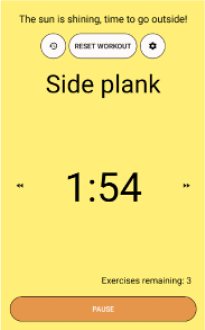
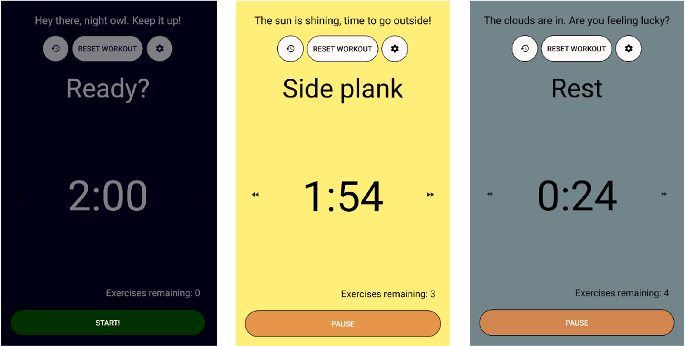
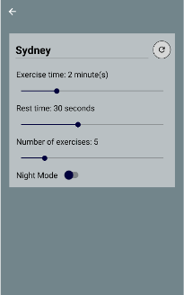
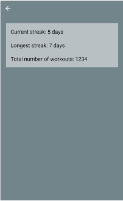

# 💪 ExerciseWeather ☀️
A customisable workout app that prompts you to get up and go outside on a nice day.

## Contents


- [Background](#background)
- [Overview](#overview)
  * [Audience](#audience)
  * [Product features](#product-features)
  * [Setup](#setup)
  * [User interface](#user-interface)
- [Concepts learnt](#concepts-learnt)
  * [OOP](#oop)
  * [Xamarin Forms](#xamarin-forms)
  * [MVVM](#mvvm)
  * [Restful APIs](#restful-apis)
  * [Data persistence with Preferences](#data-persistence-with-preferences)
  * [Data persistence with SQLite storage](#data-persistence-with-sqlite-storage)
  * [Material Icons Font](#material-icons-font)
  * [Unit Testing](#unit-testing)
  * [Git Secrets](#git-secrets)
- [TODO](#todo)
  * [Priority fixes](#priority-fixes)
  * [Future ambitions](#future-ambitions)

## Background
As part of my Cert IV in programming, I was required to produce a mobile app for Android. As I had already spent some time learning C#, this seemed like a good opportunity to dive into cross-platform development with Xamarin Forms.  
I chose to program in Visual Studio Community on Windows.

## Overview
The main purpose of this app is to provide short, high intensity workouts, based on a built-in library of exercises. When the user opens the app, it also fetches the weather data from a web service API and prompts the user to go outside if the weather is nice.  
Finally, it tracks the total number of workouts, current daily streak, and longest daily streak of the user, to provide an incentive to exercise every day.

### Audience
The target user is a young professional who is familiar with the basic exercises shown and wants to stay in shape, but spends a lot of time working inside. 

### Product features
1.	A short, high intensity workout of randomly chosen exercises that the user can start, stop, skip or reset.
2.	Weather message prompting the user to go outside.
3.	Customisable workout settings:
    - Location (city)
    - Exercise duration
    - Rest duration.
    - Number of exercises to complete.
    - Toggle night mode.
4.	Persistence of data to track ongoing daily streaks and total number of workouts completed on the app.

### Setup
1. Go to the Open Weather Maps website at [openweathermap.org](https://openweathermap.org/) and create an account.
2. Sign in and go to 'My Profile', then 'API Keys'. 
3. Copy your personal key (if necessary, you can generate a new one).
4. Clone this repository to your IDE of choice. 
5. Open the file 'ExerciseWeather/ExerciseWeather/Constants.cs'.
6. Find Line 28 and paste your key in place of the following text: ADD_YOUR_API_KEY_HERE

```
public const string APIWeatherKey = "ADD_YOUR_API_KEY_HERE";
```
You can now build the app and run on your simulator of choice!

### User interface

#### Workout Page


The Workout Page is the main page of the application, and has several buttons for user interaction:
-	The history button takes the user to the History Page (shown in detail below), which displays user statistics.
-	The settings button takes the user to the Settings Page (shown in detail below), which allows the user to modify custom inputs.
-	The weather message at the top of the page reflects the current weather and will prompt the user to go outside if it is a nice, sunny day.
-	The main label displays the current exercise to be undertaken, and will update to reflect a new exercise type when the timer reaches zero.
-	The timer label displays the timer countdown in minutes and seconds.
-	The exercises remaining label displays the number of exercises (not including rest periods) remaining until the end of the workout.
-	The ‘reset workout’ button resets the workout values so the user can start a new workout.
-	The ‘start/pause’ button will start or pause the timer, updating to reflect its current state.
-	The fast forward and rewind buttons allow the user to skip forward or backwards through the exercises in the list. 

#### Settings Page


The Settings Page starts with a text field for the user to input their current city. This has an associated button adjacent, to refresh the weather data once the city is updated. If this is not clicked, the background and weather message will automatically update to reflect the new city when the user returns to the main Workout Page. 

Following this are sliders for Exercise Time, Rest Time and Number of Exercises, for customisation of the workout. These are automatically saved into Preferences  and current values will be used for any subsequent workouts.

Finally, there is a switch to toggle Night Mode.
<br clear="left"/>

#### History Page


The History Page displays the user’s workout statistics, including Current Streak, Longest Streak, and Total Number of Workouts.

This data will persist and be updated in a local SQLite database for as long as the application is installed.
<br clear="right"/>

## Concepts learnt

### OOP
Although this was not my first experience with Object Oriented Programming, developing the ExerciseWeather application has given me opportunity to practice these concepts, especially incorporating the relatively new concepts of Unit Testing and MVVM.

One area in particular tested (and still tests) my application of OOP, which is the Workout methods. Although I would like to remove the relevant methods and attributes to a separate Workout Class, I have struggled with this due to the Timer and its relationship with the interface via INotifyPropertyChanged.

### Xamarin Forms
Xamarin Forms and XAML were new to me on this project, so it was quite a steep learning curve, although I did find many similarities with HTML and XML. I found XAML straight forward to use as a building block for the interface and enjoyed its simplicity and easy re-usable styles.

### MVVM
The pattern of Model-View-ViewModel was chosen in order to loosely couple the Views with the business logic and allow for comprehensive unit testing.
As a result of this choice, Commands are used to define both Button behaviour and  methods to be fired in the OnAppearing() and OnSizeAllocated() methods of the View. Further, INotifyPropertyChanged is used for the property binding of UI elements such as buttons and labels.

Access to standard page navigation functionality and page attributes are provided to the ViewModel by dependency injection. The injection of INavigationService and IPageService interfaces provide navigation methods such as ‘PushAsync’ and access to information such as page width and height.

### Restful APIs
The OpenWeatherMaps current weather data API is used to fetch the current weather information in XML format (this was a requirement of the course). This is then used to create a WeatherDay object which to fill the relevant UI labels.

### Data persistence with Preferences
Xamarin.Essentials:Preferences are used for persistent storage of the user's custom inputs in Settings. This is a quick and easy way to save simple data, but could not be used for the more complicated user statistics.

### Data persistence with SQLite storage
User statistics are retrieved from a local SQLite database as each page is loaded and stored in a 'UserStats' object. This is used to fill any relevant UI labels on the page. When the user completes a workout, these values are then used as a starting point to calculate the new, updated values which are automatically saved back to the database.

### Material Icons Font
What a great discovery! I had not used a Font for Icons before, and this was fun and easy way to add standard icons to my History, Settings and Skip buttons.

### Unit Testing
This project gave me the opportunity to expand my understanding and practice of Unit Testing. I think I could learn to love a tool that gives me constant feedback and alerts me immediately when I've broken something 😄 I used NUnit to write my tests and enjoyed every minute of it. Automation is king!

As this came at the end of my course, I did not have the time (at the time) to fully unit test my code. This is at the top of my TODO list, and I think will be a comprehensive learning exercise. Next project, I will surely start with Unit Testing in mind, if not even trialling Test Driven Development.

### Git Secrets
This is very new to me and was only discovered on publishing this project. Unfortunately, I have not had the chance to understand git-secrets yet, and as such will be making a small change to the code instead. This is now at the top of my ToDo list.

## TODO

### Priority fixes
1. Set up App.config file for better API key storage / understand git-secrets.
2. Complete Unit Testing.
3. Consider refactoring to further meet MVVM and OOP principles. In particular, the Workout methods may be removed as a separate Class.
4. Add an application icon.  
5. Add specific alerts for why the weather won't load (internet connection vs. missing input).  
6. Improve app responsiveness (better understand errors regarding 'skipped frames'). 
7. Include validation of City input in Settings.
8. Update weather data on 'return' click within City input in Settings.

### Future ambitions
- Input custom exercises.  
- ‘Pre-made’ workouts with different focus (back, front, legs, etc).  
-	Use GPS location for weather data.  
- More specific weather messages based on temperature, predicted rain, etc.
-	Update background to reflect weather (including toggling simple background for accessibility)
- Automatic night mode to reflect phone mode
-	Achievement badges for workouts completed, with potential for sharing on social media.  
-	Push notifications at a chosen time for the user to do a workout.
